<!-- Cyber Signal — all SVG files sit BESIDE README.md. No assets folder needed. -->

<picture>
  <source media="(prefers-reduced-motion: reduce) and (max-width: 600px)" srcset="./banner-mobile-still.svg" />
  <source media="(prefers-reduced-motion: reduce)" srcset="./banner-still.svg" />
  <source media="(max-width: 600px)" srcset="./banner-mobile.svg" />
  
</picture>

 

  
  &nbsp;&nbsp;
  

<picture>
  <source media="(prefers-reduced-motion: reduce)" srcset="./signal-still.svg" />
  
</picture>

<picture>
  <source media="(prefers-reduced-motion: reduce) and (max-width: 600px)" srcset="./skills-mobile-still.svg" />
  <source media="(prefers-reduced-motion: reduce)" srcset="./skills-still.svg" />
  <source media="(max-width: 600px)" srcset="./skills-mobile.svg" />
  
</picture>
# Shmy1234
